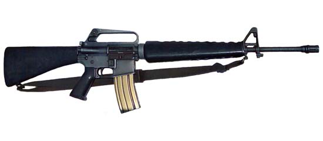
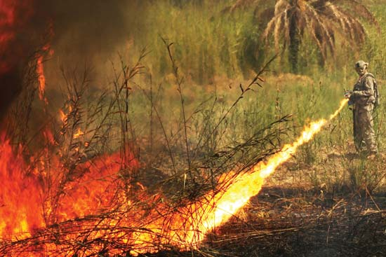
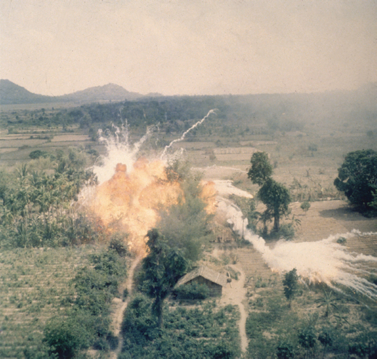
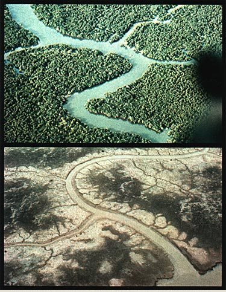

The Improved Weapons of the Vietnam War
=======================================

M16 rifle
---------
| --- | --- |
|  | The M16 rifle, also known as the AR-15, was a weapon that was designed to have improved reliability in conditions of Vietnam. Vietnam had a lot of rainstorms that made it hard for most weapons to be reliable. Not only was it reliable but it was lightweight and accurate relative to other rifles. Even today it is still used in the military. That said, it’s just a rifle so it is not the most dangerous. |

Flamethrower
------------
| --- | --- |
|  | Flamethrowers were developed during WWI by Germany. They work by using a propellant and a incendiary. The incendiary that was used was Napalm. They only have a continuous firing time of less than a minute. They excelled at clearing out vegetation that could be used as cover and killing people in foxholes. The flamethrower is considerably more dangerous than the m16 rifle as it burns everything it is pointed at, but it isn’t the most dangerous as it has a relatively short amount of firing time. |

Napalm
------
| --- | --- |
|  | Napalm is a gel-like substance with gasoline in it. The name “napalm” comes from naphthene and palmitate. The most dangerous part about it is that it sticks to whatever it touches while burning. Not only does it cause burns but it also kills by asphyxiation. It is used in both bombs and flamethrowers. It’s use wasn’t banned, but its usage was limited to when it can save civilian lives. Napalm is equally as dangerous as a flamethrower because it is the incendiary. |

Agent Orange
------------
| --- | --- |
|  | Agent Orange is a herbicide that causes plants to die and lose their leaves. Agent Orange got its name from the orange band on the barrels it was stored in. It was used to take away jungle cover that the Vietcong could hide in, along with killing their food supply. The problems with using Agent Orange is that it contained a contaminate called dioxin. Because of this contaminate, it was the only weapon that’s usage hurt people on both sides of the war. All the weapons are dangerous, but this one is the most dangerous exclusively because it hurt the people using it. |
